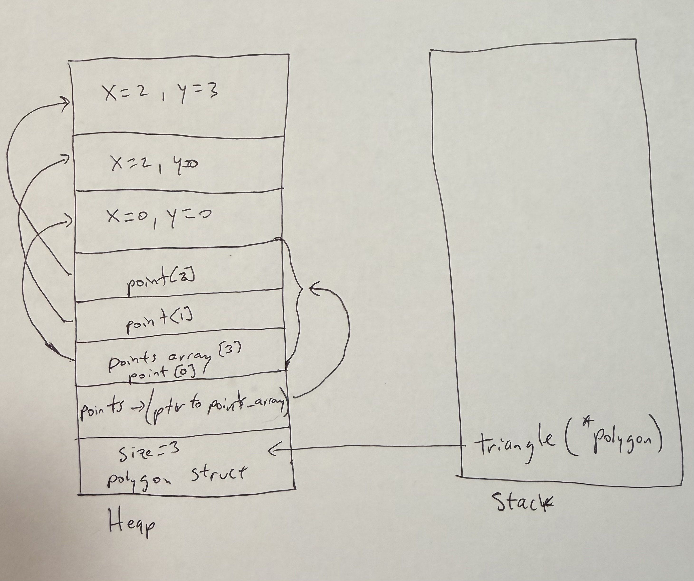
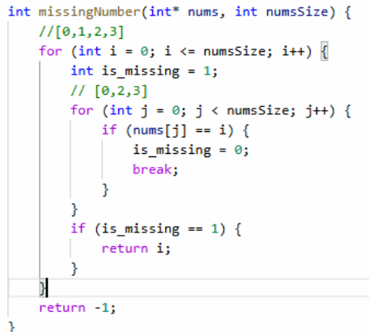

# Homework - C Practice Report
Name: Najib Mosquera

Completely answer the report questions below. Make sure to double check the final version to make sure it is easily readable on your github repository. 

1. What is the difference between a standard numeric type (int, float, double) and a pointer?  
   -For int, float and double, are the types that the variables will get. The actual values inside the variables that they will get.
   -Now the pointer it does not store the actual value, the pointer stores the memory address of the variable. You can use the pointer to print the value.
2. In your test file, we had the following code:
    
    ```c
    int* arr = create_array_of_ints_fib(5);
    int expected[] = {1, 1, 2, 3, 5};
    ```
    Later in the code we only `free(arr)` but not expected. Why is this? What is the difference in where they are stored in memory?  
    -Because running the function and storing it in arr, this create the memory allocation in the heap which needs to be free afterwards, on the other hand, expected[] is created
    in the stack which it doesn't have to be free.

3. What is the difference between the heap and stack when related to memory allocation and management?  
   The stack is a region of memory used for local variables and function calls. Its memory is managed automatically, when a function ends, its stack variables are cleaned up. 
   The heap is a region of memory used for dynamic allocation with functions like malloc, or calloc. Unlike the stack, heap memory must be managed manually by the programmer using free() to avoid memory leaks.
4. Take the following code:
   ```c
   #include <stdio.h>
   #include <stdlib.h>

   typedef struct {
     int x, y;
   } Point;

   Point * new_point(int x, int y) {
     Point pt = {x, y};
     return &pt;
   }

   int main() {
      Point* point = new_point(10, 10);
      printf("x: %d, y: %d", point->x, point->y);
      return 0;
   }
   ```
   Would the code run correctly? Even if it does compile, what would be some potential runtime issues? After answering your thoughts, put the output of a run below (you may need to run it a few times).
   ```text
   crashing because is using the address in memory
   ```

   Fix the code in the following block:
   ```c
   #include <stdio.h>
   #include <stdlib.h>

   typedef struct {
     int x, y;
   } Point;

   Point new_point(int x, int y) {
     Point pt = {x, y};
     return pt;
   }

   int main() {
      Point point = new_point(10, 10);
      printf("x: %d, y: %d", point.x, point.y);
      return 0;
   }
   ```

5. When you use `malloc`, where are you storing the information?  The information is stored in the heap.

6. Speaking about `malloc` and `calloc`, what is the difference between the two (you may need to research it!)?  Malloc is use when the initial comments can be anything
takes one arugment which is the number of bytes we want to try to allocate. Malloc does not initialize the memory and it will use whatever value already in the memory.
Calloc on the other hand will initialize everything to zero, takes two arguments one is the number of values and the other the size each value. in Calloc everything gets initialized to zero.

7. What are some common built in libraries used for C, list at least 3 and explain each one in your own words. Name a few (at least 3) functions in those libraries (hint: we used two of the most common ones in this assignment. There are many resources online that tell you functions in each library - you need to include at least 1 reference, but ideally for every library, you should have a reference to it)?
   - Example: stdlib.h - provides functions for general-purpose operations including
              memory management and random numbers [1].
     - void * malloc(size_t) - allocates memory specified in size on the heap and returns a pointer to that location
     - void * calloc(size_t num_elements, size_t element_size) - contiguous allocation for allocating arrays with the default value of 0. Slower than malloc. 
     - int rand(void) - returns a random integer between 0 and RAND_MAX. Seed should be set before hand. 
   1. string.h - provides function for c style strings and memory blocks
      * char *strcpy(char *new_string, const char *og_string) - copies one string into another
      * int strcmp(const char *string1, const char *string2) - compares two strings, returns 0 if equal
      * size_t strlen(const char *string) - returns the length of a string, it doesn't count null at the end
   
   2. stdio.h - provides the fundamentals of C like input/output, this will help to read, write and file operations
      * printf(const char *format, ...) – writes formatted output to stdout
      * fopen(const char *filename, const char *mode) – opens a file for reading/writing.
      * fread(void *ptr, size_t size, size_t nmemb, FILE *stream) – reads data from a file into a buffer.
 
   3. math.h - provides math functions
      * double pow(double base, double exp) – raises a number to a power
      * double sqrt(double x) – returns the square root of x
      * double sin(double x) – returns the sine of an angle in radians
 

8. Looking at the struct Point and Polygon, we have a mix of values on the heap, and we make ample use of pointers. Take a moment to draw out how you think that looks after `create_triangle(2,3)` is called (see an example below). The important part of the drawing it to see that not everything is stored together in memory, but in different locations! Store the image file in your github repo and link it here. You can use any program to draw it such as [drawIO](https://app.diagrams.net/), or even draw it by hand and take a picture of it.  



## Technical Interview Practice Questions
For both these questions, are you are free to use what you did as the last section on the team activities/answered as a group, or you can use a different question.

1. Select one technical interview question (this module or previous) from the [technical interview list](https://github.com/CS5008-khoury/Resources/blob/main/TechInterviewQuestions.md) below and answer it in a few sentences. You can use any resource you like to answer the question.  Explain the process of opening, reading, writing, and closing a file in C. What do we need to watch out for?  In C you open a file with fopen(), specifying like "r" (read) or "w" (write). Always see if the file actually opened (not NULL). You may then use functions like fgets() or fscanf() to read, and fprintf() or fputs() to write. How to fread() Call fclose() When you are done, call fclose(). Just be mindful of file modes (like "w" mode will clobber your data), buffer sizes, etc. and be sure to close the file without fail to prevent lost data.

2. Select one coding question (this module or previous) from the [coding practice repository](https://github.com/CS5008-khoury/Resources/blob/main/LeetCodePractice.md) and include a c file with that code with your submission. Make sure to add comments on what you learned, and if you compared your solution with others.  
268. Missing Number  



## Deeper Thinking
In Java and Python, do you think new objects are stored on the stack or the heap? Feel free to work through your thoughts as to why it would be better to store them on the stack or heap. You should consider pass by reference, and how that is similar to pointer in your answer. Feel free to use resources, but make sure to cite them, and include the citation below using ACM format. You will note LLMs are not valid references, but they can give you directions to valid references. Make sure to use your own words. 

Answer here using a paragraph (not just bullet points).  

In Python you don’t manually create things on the heap, the interpreter does it automatically whenever you create objects. In C you can create things in the heap with the malloc or calloc functions, but most of the time malloc is used. In C you also need to do the cleanup with free, while in Python this happens automatically with the garbage collector. This difference is important because in C you have more control but also more responsibility. If you forget to call free, the program will leak memory over time. Python avoids this by letting the runtime handle memory, which makes coding easier but hides the details. In both languages, variables hold references to objects on the heap, which allows objects to stay alive and be shared across functions even after a function call ends. This is one of the main reasons why objects are stored on the heap rather than the stack, since the stack is cleared whenever a function finishes.


## References
Add any references you use here. Use ACM style formatting, adding to the numbers as you add the reference. 

1. cppreference.com Contributors. 2025. Standard library header <stdlib.h>. cppreference.com. Retrieved May 1, 2025 from https://en.cppreference.com/w/c/header/stdlib

2. Tutorialspoint. 2025. C Library – <stdio.h>. Retrieved September 22, 2025 from https://www.tutorialspoint.com/c_standard_library/stdio_h.htm

3. GeeksforGeeks. 2025. C string functions. GeeksforGeeks. Retrieved from https://www.geeksforgeeks.org/c/string-functions-in-c/

4. C Math.h. Retrieved from https://www.programiz.com/c-programming/library-function/math.h

## Resource/Help: Linking to images?
To link an image, you use the following code

```markdown

```
for example
```markdown

```


Here is a sample using: 
```c
void my_func() {
    Polygon* r = create_rectangle(5,5);
    printf("The area of the rectangle is %d\n", area(r));
}
```


Note: This is a simplified version. However, it helps illustrate why we need to use `free` on the pointers in the struct. If we do not, we will have memory leaks! (memory that is allocated, but not freed, and thus cannot be used by other programs). In the above example code, `r` is created, and then the variable is destroyed when the function ends. However, the memory allocated for the struct is not freed, and thus we have a memory leak.

When you work on your version for `create_triangle(2, 3)`, you do not have to be exact on the memory structure (the locations on the heap were randomly chosen). The idea is more to show how the memory is stored, and the pointers to different memory addresses. 

